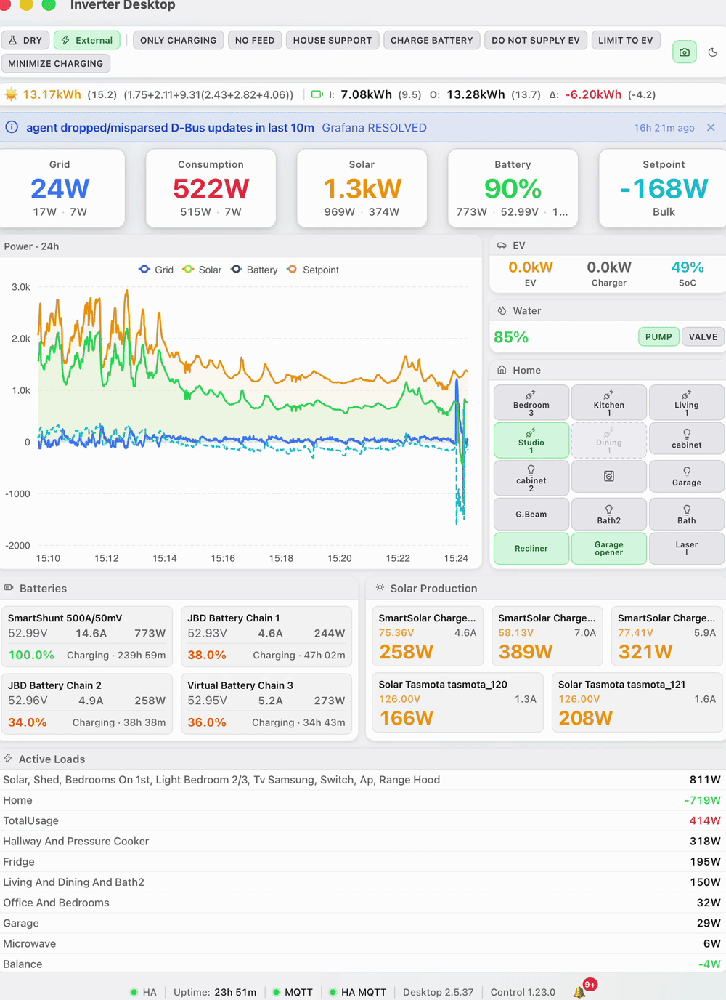
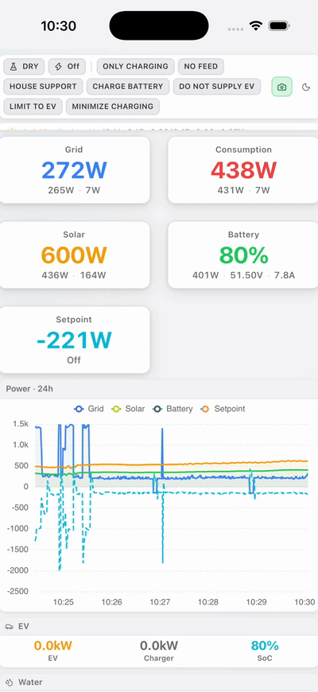
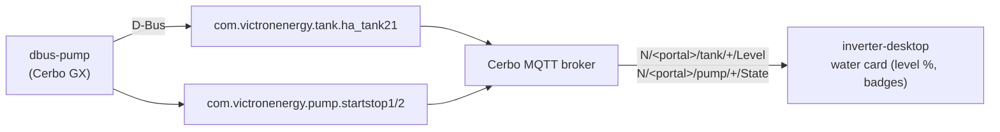
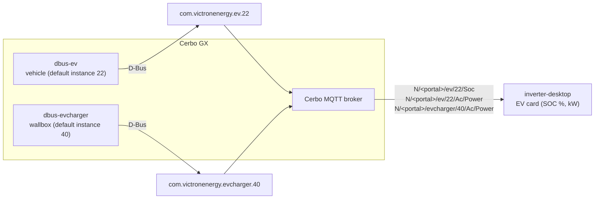

# Inverter Dashboard

[](https://opensource.org/licenses/MIT)
[](https://github.com/victron-venus/inverter-desktop/commits/main)
[](https://github.com/victron-venus/inverter-desktop/graphs/commit-activity)
[](https://github.com/victron-venus/inverter-desktop/actions/workflows/ci.yml)
[](https://github.com/victron-venus/inverter-desktop/actions/workflows/codeql.yml)
[](https://oss-fuzz.com/testcases?project=inverter-desktop)
[](https://www.rust-lang.org/)
[](https://tauri.app/)

Desktop and mobile application for monitoring Victron inverter systems via MQTT. Built with Tauri + TypeScript.

Android and iOS contain the inverter core: telemetry, MQTT controls, Cerbo EV/water,
charts, and core notifications. Home Assistant, cameras, and the plugin ecosystem
are desktop-only. Implementation progress is tracked in [TODO.md](TODO.md), with
the build boundary documented in
[desktop features and mobile core](docs/desktop-features-and-mobile-core.md).

Desktop settings now include a **Plugins** tab for reviewing signed packages,
installing/updating, enabling/disabling, rolling back, and uninstalling them. The
[native package pipeline](docs/plugin-packages.md) verifies the selected archive
before showing its identity, version, publisher, and declared capabilities. Only
an explicit Install/Update action commits those reviewed bytes. Enabled installed
workers can resume after authentication and stop on logout. Configuration-capable
packages have a [typed settings editor](docs/plugin-settings.md) with isolated
encrypted records and write-only secrets. Saving restarts enabled workers with
acknowledged configuration; uninstall retains settings unless deletion is selected.
An on-demand stored-data view shows usage and allows confirmed cleanup of records
with no installed owner, including corrupt records or unavailable credentials.
Data belonging to installed packages stays protected from this cleanup.

**The current release publisher policy is empty, so package installation is
disabled.** The manager reports this directly; it does not offer unsigned packages
or user-supplied trust. Production publisher provisioning remains a separate step.
Home Assistant and cameras still come bundled with desktop and are not managed as
packages yet. A separately built [Frigate worker](desktop-plugins/frigate/README.md)
starts their extraction with an independent MQTT connection, native motion
notifications, and direct completed-clip requests handled by owned native media
services. Clip/window acceptance is tracked separately from source implementation.
Snapshots, optional HA proxy support, other camera adapters, and migration remain.
A separately built [Home Assistant worker](desktop-plugins/home-assistant/README.md)
adds authenticated connection status and state cards for a configured entity
list. Optional sensor prefixes discover read-only cards in remaining slots;
explicit targets retain priority. Read-only operation is the default; explicit action lists enable fixed
HA button presses, scene activation, media-player Play/Pause/Stop, explicit
switch/helper/light on/off commands, supported cover Open/Close/Stop, bounded
numbers and cover positions through instance-bound plugin controls. Numeric
changes require explicit Apply within the advertised bounds and step; position
writes require a separate selection. Cover capabilities update the available actions.
Each entity's state and explicitly selected controls appear together in a card;
equal friendly names do not merge entities, and discovery remains read-only.
Explicitly watched weather entities show their condition and reported temperature
with its supplied unit. Up to five legacy forecast entries can be shown when
already present in the state; separate modern forecast retrieval remains pending.
An explicitly configured read-only dishwasher profile combines its running state
and reported runtime since midnight in the existing state card. It does not infer
roles, add controls or calculate remaining time.
Optional washer and dryer profiles show explicitly selected remaining-time readings
as reported, including zero, without inferring activity or running a local
countdown. Appliance actions require separate explicit button selection.
Displayed state follows Home Assistant updates rather than assuming a service
call changed the device.
The worker owns its REST/WebSocket connection and isolated token. Other HA
services, legacy UI parity, and migration remain tracked work; core inverter
buttons continue to use MQTT independently.
See the [worker protocol](docs/plugin-worker-protocol.md) and
TODO for the remaining work and validation boundaries.

| Surface                     | Recommended project                                                                                    |
| --------------------------- | ------------------------------------------------------------------------------------------------------ |
| Cerbo GX (web)              | [inverter-dashboard-go](https://github.com/victron-venus/inverter-dashboard-go)                        |
| Docker / NAS                | [inverter-dashboard](https://github.com/victron-venus/inverter-dashboard) (`alvit/inverter-dashboard`) |
| Desktop / mobile (this app) | **inverter-desktop**                                                                                   |

## Demo

Earlier **Inverter Desktop** recordings on macOS and iOS Simulator show real-time
grid, solar, battery, EV, water, and controls over MQTT. The iOS recording predates
the core-only mobile feature boundary described above.

**macOS**

<p align="center">
  
</p>

**iOS Simulator**

<p align="center">
  
</p>

---

## Project Role

**Native desktop application for Victron inverter monitoring.** Built with Vue 3 + Electron/Tauri. Uses shared components from [inverter-dashboard-vue](https://github.com/victron-venus/inverter-dashboard-vue).

| Use Case                   | Recommended                                                                                                             |
| -------------------------- | ----------------------------------------------------------------------------------------------------------------------- |
| Cerbo GX / embedded        | [inverter-dashboard-go](https://github.com/victron-venus/inverter-dashboard-go) — single binary, minimal footprint      |
| Docker / NAS               | [inverter-dashboard](https://github.com/victron-venus/inverter-dashboard) — Python/FastAPI (`alvit/inverter-dashboard`) |
| Native desktop/mobile      | **inverter-desktop** (this) — Rust/Tauri app with offline support                                                       |
| Building custom dashboards | [inverter-dashboard-vue](https://github.com/victron-venus/inverter-dashboard-vue) — shared Vue 3 component library      |

- Real-time power monitoring (Grid, Solar, Battery, Consumption)
- Interactive controls via MQTT
- Live power charts with ECharts
- EV charging status
- Water system monitoring (dbus-pump via Cerbo MQTT)
- Home automation controls and cameras on desktop
- Native application for all major platforms

## Supported Platforms

| Platform    | Installation                   | Notes                                         |
| ----------- | ------------------------------ | --------------------------------------------- |
| **macOS**   | `.dmg` installer from Releases | Universal binary (Apple Silicon + Intel)      |
| **Windows** | `.msi` or `.exe` installer     | x64                                           |
| **Linux**   | `.AppImage`, `.deb`, `.rpm`    | Various distributions                         |
| **iOS**     | AltStore, TestFlight, Xcode    | Requires Apple Developer account for AltStore |
| **Android** | APK (direct install or ADB)    | arm64-v8a, armeabi-v7a, x86_64                |

---

<!-- ci-release-process:start -->

## Release process

See the [release strategy](RELEASING.md) for validation, nightly, beta, RC and stable promotion rules, and the [operator runbook](docs/release-workflow.md) for local commands.
<!-- ci-release-process:end -->

---

## Completed Features

- ✅ **Release packaging**: Candidate artifacts and checksums; see the [release strategy](RELEASING.md).
- **Manual updates**: Choose **Download updates…** in the dashboard menu to open the latest release and install the package for your platform. The app does not download or install updates automatically.
- ✅ **Encrypted Storage**: Integrated `@tauri-apps/plugin-store` for encrypted local persistence of MQTT credentials, HA access tokens, and custom layout preferences (PR: feat/encrypted-storage)
- ✅ **Native Mobile Notifications**: Implemented `@tauri-apps/plugin-notification` for OS-level push alerts when Battery SoC drops below 20% or grid connection is lost (PR: feat/native-notifications)
- ✅ **Cargo Security Audit**: Added `cargo-deny` configuration to enforce dependency security and license compliance checks in CI (PR: feat/cargo-security-audit)

---

## Installation

### macOS

1. Download `.dmg` from [Releases](https://github.com/victron-venus/inverter-desktop/releases/latest)
2. Open the `.dmg` file
3. Drag **Inverter Dashboard.app** to Applications
4. On first run: Right-click → Open → Open (bypasses Gatekeeper)

> **Note:** If you see the message “Inverter Desktop.app is damaged and can’t be opened”, macOS has quarantined the download. Remove the quarantine attribute from the `.dmg` before opening it:
>
> ```bash
> xattr -d com.apple.quarantine ~/Downloads/Inverter.Desktop_2.5.2_aarch64.dmg
> ```
>
> (Use the matching `*_x64.dmg` on Intel Macs, or the full path if the file is elsewhere.) After removing the attribute, open the `.dmg` and launch normally.

### Windows

1. Download `.msi` or `.exe` installer from [Releases](https://github.com/victron-venus/inverter-desktop/releases/latest)
2. Run installer, follow prompts
3. Launch from Start Menu or Desktop shortcut

### Linux

**AppImage (recommended):**

```bash
chmod +x Inverter-Dashboard_*.AppImage
./Inverter-Dashboard_*.AppImage
```

** Debian/Ubuntu (.deb):**

```bash
sudo dpkg -i inverter-dashboard_*.deb
sudo apt-get install -f  # install dependencies if needed
```

** RHEL/Fedora (.rpm):**

```bash
sudo rpm -i inverter-dashboard_*.rpm
```

---

### Google Play preparation

Maintainers can build a separately upload-key-signed Android App Bundle with the manual [Google Play workflow](docs/google-play.md). Existing GitHub APK signing remains unchanged; Play enrollment must preserve the existing app signing certificate for cross-store upgrades. Android 64-bit builds now align both load segments and RELRO boundaries for 16 KB pages; the Play workflow checks the actual bundle before signing.

### iOS Installation

Starting with 2.5.40, the iOS app and build versions match the release; earlier IPAs could report 1.0.0. The IPA remains unsigned for sideloading.

iOS requires sideloading since the app is not on the App Store. Two options:

#### Option 1: AltStore (Recommended for personal use)

AltStore allows sideloading apps with a free Apple ID (no paid developer account needed).

**Prerequisites:**

- iPhone/iPad running iOS 26 or later
- A free [Apple ID](https://appleid.apple.com/) account
- AltServer installed on your Mac or PC

**Step 1: Install AltServer**

1. Download AltServer for your platform:
   - **macOS**: Download from [AltStore.io](https://altstore.io/) or via Homebrew:
     ```bash
     brew install --cask altstore
     ```
   - **Windows**: Download from [AltStore.io](https://altstore.io/)

2. Start AltServer (it runs in the menu bar/system tray)

**Step 2: Install AltStore on your device**

1. Open AltServer on your Mac/PC
2. Connect your iPhone/iPad via USB
3. On iOS: Go to Settings → General → Device Management → tap your Apple ID
4. Trust the profile if prompted

**Step 3: Sideload the app**

1. Download the `.ipa` file from [Releases](https://github.com/victron-venus/inverter-desktop/releases/latest)
2. Double-click the `.ipa` to open it in AltStore
3. Select your connected device
4. Wait for installation to complete

**Refresh requirement:** AltStore apps expire after 7 days. Keep AltServer running to auto-refresh, or:

- Right-click AltStore icon → Refresh apps
- Or right-click the app in AltStore → Refresh

**Step 4: Trust the app**

1. On iOS: Settings → General → VPN & Device Management
2. Find "Inverter Dashboard" under your Apple ID
3. Tap Trust → Confirm

#### Option 2: TestFlight (If available)

If a TestFlight beta is available:

1. Accept the TestFlight invite
2. Install TestFlight from App Store
3. Open the beta link and tap "Install"

#### Option 3: Xcode (For developers)

1. Download `.ipa` from [Releases](https://github.com/victron-venus/inverter-desktop/releases/latest)
2. Connect your device via USB
3. Open Xcode → Window → Devices and Simulators
4. Select your device → Click "+" → Select the `.ipa`
5. On first install, enable "Trust this app" in device settings

**Troubleshooting iOS:**

- App won't open: Settings → General → Device Management → Trust the app
- AltStore offline: Ensure AltServer is running and device connected
- Refresh failed: Check internet connection, try again

---

### Android Installation

#### Option 1: Direct Install (APK)

1. Download the `.apk` from [Releases](https://github.com/victron-venus/inverter-desktop/releases/latest)
2. Transfer to your Android device
3. Open the APK file
4. If prompted about unknown sources: Settings → Security → Allow unknown sources
5. Tap Install

**Note:** You may need to enable "Install unknown apps" for your browser or file manager.

#### Option 2: ADB Installation (Recommended for developers)

ADB gives you more control and is useful for debugging.

**Prerequisites:**

```bash
# Install ADB (macOS)
brew install android-platform-tools

# Install ADB (Ubuntu/Debian)
sudo apt install adb

# Install ADB (Windows) - download from:
# https://developer.android.com/studio/releases/platform-tools
```

**Step 1: Enable USB Debugging**

1. Go to Settings → About Phone
2. Tap "Build Number" 7 times → Developer mode enabled
3. Go back to Settings → Developer Options
4. Enable "USB Debugging"
5. Connect your device via USB

**Step 2: Verify connection**

```bash
adb devices
# Should show: "xxxxxxxx    device"
```

If you see "unauthorized", check your phone for a pairing confirmation dialog.

**Step 3: Install APK**

```bash
# Download the APK first
wget https://github.com/victron-venus/inverter-desktop/releases/latest/download/inverter-dashboard-android.apk

# Install
adb install inverter-dashboard-android.apk
```

**Step 4: Launch**

```bash
# Option A: From command line
adb shell am start -n com.alvit.inverter_dashboard/.MainActivity

# Option B: Tap the app icon on your device
```

**Useful ADB Commands**

```bash
# View logs (for debugging)
adb logcat -s "Inverter Dashboard"

# Reinstall (keeps app data)
adb install -r inverter-dashboard-android.apk

# Uninstall
adb uninstall com.alvit.inverter_dashboard
```

#### Option 3: Via Local Network (Wireless ADB)

```bash
# Connect via USB first, then enable wireless
adb tcpip 5555

# Disconnect USB, find device IP on phone
# Settings → About Phone → Status → IP address

# Connect wirelessly
adb connect <device-ip>:5555

# Install
adb install inverter-dashboard-android.apk
```

---

## Configuration

To disconnect inverter telemetry, clear the MQTT host and disable IGW (or remove its required connection settings), then save. This stops both inverter transports, clears their displayed telemetry, and cancels pending reconnect attempts. On desktop, the separate camera MQTT connection remains controlled by its own settings. Reconfigure either inverter transport to reconnect.

Edit `src-tauri/capabilities/default.json` and `src/config.ts` for MQTT settings:

```typescript
const config = {
  mqttHost: '192.168.1.100',
  mqttPort: 1883,
  // ... other settings
}
```

---

## MQTT Topics

### Subscribed (incoming data)

- `inverter/state` - JSON with current system state
- `inverter/console` - Console log messages
- `N/<portal>/tank/+/Level` - Tank level % (dbus-pump on the Cerbo GX)
- `N/<portal>/pump/+/State` - Pump/valve startstop state (dbus-pump)
- `N/<portal>/ev/+/Soc` - EV vehicle battery % (dbus-ev on the Cerbo GX)
- `N/<portal>/ev/+/Ac/Power` - EV vehicle charging power in W (dbus-ev)
- `N/<portal>/evcharger/+/Ac/Power` - Wallbox/clamp charging power in W (dbus-evcharger)

### Water system

Water data comes **exclusively** from the [dbus-pump](https://github.com/victron-venus/dbus-pump)
services via Cerbo MQTT — no Home Assistant involved. Configure the portal ID and the
`water_pump_instance` / `water_valve_instance` (defaults 1/2) in the app config; they must match
dbus-pump's `local_config.py`. Valve/pump automation lives in dbus-pump itself; this app is
read-only (status badges only).



### EV system

EV data comes **exclusively** from Cerbo MQTT — no Home Assistant involved. Two dbus services
on the GX expose the metrics:

- [dbus-evcharger](https://github.com/victron-venus/dbus-evcharger) — D-Bus
  `com.victronenergy.evcharger.<N>` (default instance **40**) publishes
  `N/<portal>/evcharger/40/Ac/Power` (W).
- [dbus-ev](https://github.com/victron-venus/dbus-ev) — D-Bus `com.victronenergy.ev.<N>`
  (default instance **22**) publishes `N/<portal>/ev/22/Soc` (%) and
  `N/<portal>/ev/22/Ac/Power` (W).

Configure `evcharger_instance` and `ev_instance` in the app config; they must match the GX
services' `DEVICE_INSTANCE`. Both power paths are read in **watts**; the UI displays them as kW.
The EV section shows when Cerbo MQTT is connected and at least one of SOC / vehicle power /
wallbox power is live.



### Inverter controls and Home Assistant

`inverter-control` owns the seven operating flags, publishes their values in
`inverter/state.booleans` and supplies button metadata through
`inverter/state.ui_config.header_toggles`. Desktop consumes that MQTT contract;
Home Assistant is an optional parallel consumer that exposes MQTT switches.
HA entities do not supply inverter flag state or execute these commands.

Desktop keeps a fallback button list for older daemons without metadata. A saved
nonempty `header_toggles_config` overrides the published labels/order; an empty
local list uses the daemon defaults. See [control ownership](docs/mqtt-control-ownership.md)
for source files, wire compatibility, HA switch configuration and validation.

### Published (commands)

- `inverter/cmd/toggle` - Set an inverter-control flag using a bare key and explicit state, e.g. `{"entity":"no_feed","state":"on"}` (QoS 1, retain=false). All seven flags use Cerbo MQTT regardless of HA settings. Saved `input_boolean.<key>` aliases remain supported. See [control ownership and compatibility](docs/mqtt-control-ownership.md).
- `inverter/cmd/press` - Press button entities
- `inverter/cmd/setpoint` - Set power setpoint
- `inverter/cmd/dry_run` - Toggle dry run mode
- `inverter/cmd/limits` - Set power limits
- `inverter/cmd/ess_mode` - Toggle ESS mode
- `inverter/cmd/loop_interval` - Set control loop interval

---

## Expected State Format

```json
{
  "gt": 150,
  "g1": 100,
  "g2": 50,
  "tt": 2500,
  "t1": 1500,
  "t2": 1000,
  "solar_total": 3500,
  "battery_soc": 85,
  "battery_power": -500,
  "battery_voltage": 52.4,
  "setpoint": 0,
  "inverter_state": "Inverting",
  "dry_run": false,
  "ess_mode": {
    "mode_name": "Optimized (with BatteryLife)",
    "is_external": false
  },
  "booleans": {
    "only_charging": true,
    "no_feed": false
  },
  "ui_config": {
    "header_toggles": [
      { "id": "only_charging", "label": "ONLY CHARGING", "entity": "only_charging" },
      { "id": "no_feed", "label": "NO FEED", "entity": "no_feed" }
    ]
  },
  "daily_stats": {
    "produced_today": 25.5,
    "produced_dollars": 7.65,
    "grid_kwh": 2.3
  }
}
```

---

## Security

This project includes comprehensive security measures:

- **Security Policy**: See [SECURITY.md](SECURITY.md) for vulnerability reporting
- **Fuzzing**: Automated fuzz testing via [FUZZING.md](FUZZING.md)
- **OSS-Fuzz Integration**: Continuous fuzzing with [OSS_FUZZ_GUIDE.md](OSS_FUZZ_GUIDE.md)
- **OpenSSF Best Practices**: Badge effort documented in [OPENSSF_BADGE_GUIDE.md](OPENSSF_BADGE_GUIDE.md)
- **Dependency Auditing**: Regular security scans with `cargo audit`
- **Status Tracking**: Current security status in [SECURITY_STATUS.md](SECURITY_STATUS.md)

### Security Features

- ✅ **OSS-Fuzz Integration**: Continuous automated fuzzing
- ✅ **3 Fuzz Targets**: JSON parsing, MQTT handling, command parsing
- ✅ **OpenSSF Best Practices**: Working toward badge certification
- ✅ **Regular Dependency Updates**: Automated vulnerability monitoring
- ✅ **Secure MQTT**: Connection handling and input validation
- ✅ **Security Policy**: Coordinated vulnerability disclosure

### Monitoring

- **OSS-Fuzz Dashboard**: https://oss-fuzz.com/testcases?project=inverter-desktop
- **Coverage Analysis**: https://introspector.oss-fuzz.com/?project=inverter-desktop
- **OpenSSF Best Practices**: https://www.bestpractices.dev/
- **Automated Reports**: Weekly security monitoring via GitHub Actions

---

## Development

See [session, transport and credential-storage contracts](docs/desktop-hardening.md)
for migration behaviour, validation commands and hardware acceptance boundaries.

```bash
# Install dependencies
pnpm install --frozen-lockfile

# Run dev server
pnpm tauri dev

# Build for production
pnpm tauri build
```

### Building for Mobile

Mobile builds exclude the desktop feature implementations. `pnpm build` selects
the frontend from Tauri's compilation target; a standalone mobile frontend can be
built and checked with `pnpm build:mobile` and `pnpm test:mobile`. Direct release
Cargo builds for mobile require a mobile `dist/build-profile.json` receipt.

**Android:**

```bash
pnpm tauri android init
pnpm tauri android build --ci
```

**iOS:**

```bash
pnpm tauri ios init
pnpm tauri ios dev             # Run with the configured Xcode target
pnpm tauri ios build --ci      # Requires the target's signing configuration
```

The hosted iOS workflow uses `scripts/ci-build-ios-library.sh` before its Xcode
packaging steps; that helper builds the mobile frontend before invoking Cargo.

---

## Related Projects

This project is part of the Victron Venus OS integration suite:

| Project                                                                         | Description                                                              |
| ------------------------------------------------------------------------------- | ------------------------------------------------------------------------ |
| [inverter-control](https://github.com/victron-venus/inverter-control)           | Advanced ESS external control system with grid-zero targeting            |
| [inverter-dashboard](https://github.com/victron-venus/inverter-dashboard)       | Real-time web dashboard (Python/FastAPI) via MQTT                        |
| [inverter-dashboard-go](https://github.com/victron-venus/inverter-dashboard-go) | High-performance Go rewrite of the web dashboard                         |
| **inverter-desktop** (this)                                                     | Native desktop and mobile application (Rust/Tauri) for system monitoring |
| [dbus-mqtt-battery](https://github.com/victron-venus/dbus-mqtt-battery)         | MQTT to D-Bus bridge for JBD BMS battery integration                     |
| [dbus-tasmota-pv](https://github.com/victron-venus/dbus-tasmota-pv)             | Tasmota smart plug integration as a PV inverter on D-Bus                 |
| [esphome-jbd-bms-mqtt](https://github.com/victron-venus/esphome-jbd-bms-mqtt)   | ESP32 Bluetooth monitor for JBD BMS batteries                            |
| [inverter-monitoring](https://github.com/victron-venus/inverter-monitoring)     | TIG (Telegraf, InfluxDB, Grafana) monitoring stack                       |
| [terraform-github-victron](https://github.com/4alvit/terraform-github-victron)  | Infrastructure as Code for the GitHub organization                       |

---

## Author

Created by [@4alvit](https://github.com/4alvit)

## License

MIT License - see [LICENSE](LICENSE).

---

**Note:** This is a community project and is not affiliated with Victron Energy.

## Contributing

1. Fork the repository
2. Create a feature branch (`git checkout -b feature-name`)
3. Commit your changes
4. Push to the branch (`git push origin feature-name`)
5. Create a Pull Request

## Support

For issues specific to:

- **MQTT connectivity**: Check broker reachability and topic subscriptions
- **Desktop app crashes**: Review Tauri logs and system requirements
- **iOS installation**: Check AltStore/AltServer status and device trust settings
- **Android installation**: Verify ADB connection and USB debugging enabled
- **This project**: Open an issue in this repository

## Privacy

Read the [privacy policy](docs/privacy-policy.md) for information about local settings, configured services and your choices. Privacy and support contact: [alvit.work@gmail.com](mailto:alvit.work@gmail.com).
