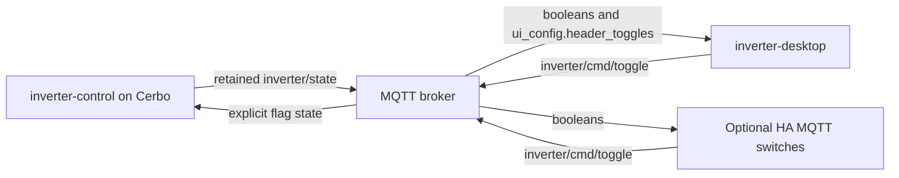

# Inverter controls: MQTT ownership and the optional HA adapter

The inverter-control daemon owns the seven operating flags: `only_charging`,
`no_feed`, `house_support`, `charge_battery`, `do_not_supply_charger`,
`set_limit_to_ev_charger` and `minimize_charging`. Home Assistant is a consumer
of their MQTT state and another client of their command API.

## State, presentation and commands

The daemon publishes flag state in `inverter/state.booleans`, and its control
descriptors in `ui_config.header_toggles`. Desktop shows that published metadata;
missing or explicitly empty lists produce no core buttons. Desktop does not
require HA credentials, entity discovery or a running HA session to show and
operate these controls.

Local header overrides, the hardcoded fallback list and the UI Controls editor
have been removed. Header Controls in Sections only controls visibility. Controls
published in `ui_config.home_buttons` retain the same MQTT ownership, including
when the HA package is absent or disabled. Custom HA controls are configured in
the separately installed HA worker. Its one-time native migration can use saved
legacy controls or actual daemon metadata; when daemon defaults are needed,
handover waits for that metadata instead of inventing a replacement layout.

For example, Desktop renders `{ "id": "export", "label": "NO FEED", "entity":
"no_feed" }` using `booleans.no_feed`. Clicking it invokes the core dispatcher;
the Rust MQTT boundary emits `{"entity":"no_feed","state":"on"}` or `"off"`
to `inverter/cmd/toggle`, QoS 1, without retain. If a caller provides an explicit
state, Desktop preserves it. Otherwise it inverts the last MQTT value, retaining
the existing initial-off fallback. Absolute state prevents duplicate delivery
of the same command from toggling twice; a successful publish is not evidence
that the daemon or physical device has applied it.

Legacy saved targets `input_boolean.<flag>` are accepted and normalized to bare
keys before publication. A real HA entity such as `switch.no_feed` is not an
inverter flag just because its suffix or local UI id matches one. Custom home
entities and custom HA header controls use the optional HA worker's declared,
instance-bound actions. The core native dispatcher rejects non-flag toggle
targets; it cannot fall back to an HA client. The worker is desktop-only.
Mobile builds show core inverter controls and
preserve unavailable HA definitions in saved settings; they contain no HA or
camera implementation. See [the platform build boundary](desktop-features-and-mobile-core.md).

## Code boundaries

- `src/inverterControl.ts`: neutral flag keys, legacy target normalization
  and MQTT state lookup.
- `src/composables/useDashboardControls.ts`: presentation composition, optional
  home-state interface and core action dispatch. Core flag state always comes
  from MQTT; the desktop entry point disables legacy non-core controls.
- `src/features/desktop/plugins/presentation.ts`: generic composition of installed
  package contributions and core controls, retaining their published positions.
- `desktop-plugins/home-assistant/src/`: separately packaged HA connections,
  explicit household actions, and compact dashboard declarations.
- `src-tauri/src/plugins/legacy_migration.rs`: native legacy settings handover
  for explicitly selected matching packages; core flag targets are excluded
  from HA action grants.
- `src/composables/useInverterVisibility.ts`: core snapshot refresh on window
  resume, independent from HA refresh and its request lifecycle.
- `src-tauri/src/inverter_control.rs`: MQTT command normalization, absolute flag
  commands and ownership classification.
- `src-tauri/src/app_visibility.rs`: core window visibility and event coalescing.

Persisted keys `ha_entities` and `header_toggles_config` remain passive migration
data for the HA package and survive core settings saves and resets. They no longer
override controller presentation. `show_header_toggles` remains the visibility
preference. The historical `ha_entities` key name does not decide the transport. Core command names and
MQTT topics remain stable. Removed legacy HA commands are replaced by the
generic installed-package action boundary. See [package installation and
configuration restoration](plugin-packages.md).

## HA MQTT switches

The daemon repository's `mqtt.yaml` defines HA switches over the same state and
command topics. Its JSON `payload_on`/`payload_off` values differ from the
`ON`/`OFF` returned by the state template, so it declares `state_on: "ON"` and
`state_off: "OFF"` explicitly. See the
[official MQTT switch options](https://www.home-assistant.io/integrations/switch.mqtt/).
This is a static HA integration example, not automatic MQTT discovery.

Adding these two state fields changes how HA confirms received state; it does
not change switch identities, command topics, JSON command payloads, or a time
trigger. A midnight or 15:00 automation that calls the same switch's explicit
`turn_on`/`turn_off` action therefore sends the same absolute command. An
automation that tests switch state, reacts to a state transition, or calls
`toggle` can observe the corrected state; those dependencies need separate
inspection before claiming identical runtime behavior. Installing or disabling
a Desktop plugin does not edit or disable HA server automations.

Ownership and physical effects are separate: `minimize_charging` is a daemon
flag, but its current dump-load actuator uses optional HA measurements/services.
Changing the flag without HA does not prove that HA-backed loads can be switched.
The other Victron functions retain their own daemon/device requirements.

The current Desktop command path for these flags requires its Cerbo MQTT client.
IGW telemetry support alone does not add a remote flag-command transport.

## Verification

Regression coverage exercises MQTT metadata and changing flag values with no HA
composable, legacy configurations, a clicked header button through the core
dispatcher, conflicting HA state, real HA entity name collisions, controls in
Home with HA disabled, and window resume without HA calls. Rust covers all seven
keys, preserved explicit states and MQTT/HA routing. The producer's mock-only
contract tests cover publication and HA switch payload/template compatibility.

Tests and builds do not connect to the installation, issue physical commands or
verify a live HA frontend. Updating the shipped HA example also requires applying
it to an actual HA installation before claiming its runtime state is verified.
