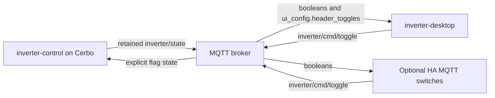

# Inverter controls: MQTT ownership and the optional HA adapter

The inverter-control daemon owns the seven operating flags: `only_charging`,
`no_feed`, `house_support`, `charge_battery`, `do_not_supply_charger`,
`set_limit_to_ev_charger` and `minimize_charging`. Home Assistant is a consumer
of their MQTT state and another client of their command API.

## State, presentation and commands

The daemon publishes flag state in `inverter/state.booleans`, and its control
descriptors in `ui_config.header_toggles`. The latter is an additive field;
older daemons without this metadata use Desktop's compatibility list. Desktop
does not require HA credentials, entity discovery or a running HA session to
show and operate these controls.

Presentation precedence is a nonempty saved `header_toggles_config`, then the
daemon list, then the compatibility list. An explicit empty daemon list remains
empty. Configuring a different button id or label does not change the flag's
authoritative state key. Controls placed in Home retain the same MQTT ownership,
including when HA features are disabled. For custom HA controls received only
through daemon metadata, save their definitions in Desktop settings to include
them in the current backend's live entity whitelist; an unsaved metadata-only
HA control is refreshed by REST at initialization/resume. This limitation does
not affect inverter-control flags.

For example, Desktop renders `{ "id": "export", "label": "NO FEED", "entity":
"no_feed" }` using `booleans.no_feed`. Clicking it invokes the core dispatcher;
the Rust MQTT boundary emits `{"entity":"no_feed","state":"on"}` or `"off"`
to `inverter/cmd/toggle`, QoS 1, without retain. If a caller provides an explicit
state, Desktop preserves it. Otherwise it inverts the last MQTT value, retaining
the existing initial-off fallback. Absolute state prevents duplicate delivery
of the same command from toggling twice; a successful publish is not evidence
that the daemon or physical device has applied it.

Legacy saved targets `input_boolean.<flag>` are accepted and normalized to bare
keys before publication. A real HA entity such as `switch.no_feed` is not an
inverter flag just because its suffix or local UI id matches one. Custom home
entities and custom HA header controls continue to use the optional HA adapter.
That adapter is desktop-only. Mobile builds show core inverter controls and
preserve unavailable HA definitions in saved settings; they contain no HA or
camera implementation. See [the platform build boundary](desktop-features-and-mobile-core.md).

## Code boundaries

- `src/inverterControl.ts`: neutral flag keys, compatibility presentation,
  legacy target normalization and MQTT state lookup.
- `src/composables/useDashboardControls.ts`: presentation composition, optional
  home-state adapter and core action dispatch. It works without `useHA`.
- `src/composables/useDashboardControlsConfig.ts`: settings for mixed dashboard
  controls in the desktop composition; MQTT flag presets do not require HA discovery.
- `src/features/coreControlsConfig.ts`: mobile core control editing, preserving
  opaque desktop control definitions when settings are saved.
- `src/composables/useHA.ts`: HA connections, entities and appliance displays;
  supplies only the optional home-state adapter to dashboard controls.
- `src/composables/useInverterVisibility.ts`: core snapshot refresh on window
  resume, independent from HA refresh and its request lifecycle.
- `src-tauri/src/inverter_control.rs`: MQTT command normalization, absolute flag
  commands and ownership classification.
- `src-tauri/src/ha_api.rs`: HA entity classification, REST routing and HA state.
- `src-tauri/src/app_visibility.rs`: shared window visibility used by both MQTT
  and HA event coalescing.

Persisted keys `ha_entities`, `header_toggles_config` and `show_header_toggles`
remain unchanged for compatibility. The historical `ha_entities` key can contain
Home controls; its name does not decide the transport. Tauri command names and
MQTT topics also remain stable. This cleanup does not implement a plugin loader.

## HA MQTT switches

The daemon repository's `mqtt.yaml` defines HA switches over the same state and
command topics. Its JSON `payload_on`/`payload_off` values differ from the
`ON`/`OFF` returned by the state template, so it declares `state_on: "ON"` and
`state_off: "OFF"` explicitly. See the
[official MQTT switch options](https://www.home-assistant.io/integrations/switch.mqtt/).
This is a static HA integration example, not automatic MQTT discovery.

Ownership and physical effects are separate: `minimize_charging` is a daemon
flag, but its current dump-load actuator uses optional HA measurements/services.
Changing the flag without HA does not prove that HA-backed loads can be switched.
The other Victron functions retain their own daemon/device requirements.

The current Desktop command path for these flags requires its Cerbo MQTT client.
IGW telemetry support alone does not add a remote flag-command transport.

## Verification

Regression coverage exercises MQTT metadata and changing flag values with no HA
composable, legacy configurations, a clicked header button through the core
dispatcher, conflicting HA state, real HA entity name collisions, controls in
Home with HA disabled, and window resume without HA calls. Rust covers all seven
keys, preserved explicit states and MQTT/HA routing. The producer's mock-only
contract tests cover publication and HA switch payload/template compatibility.

Tests and builds do not connect to the installation, issue physical commands or
verify a live HA frontend. Updating the shipped HA example also requires applying
it to an actual HA installation before claiming its runtime state is verified.
